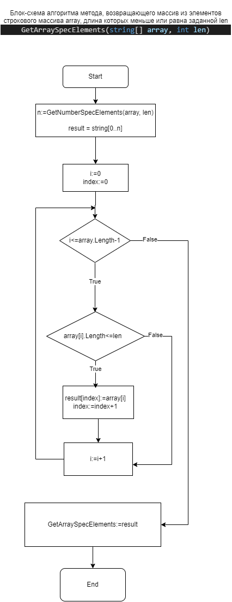
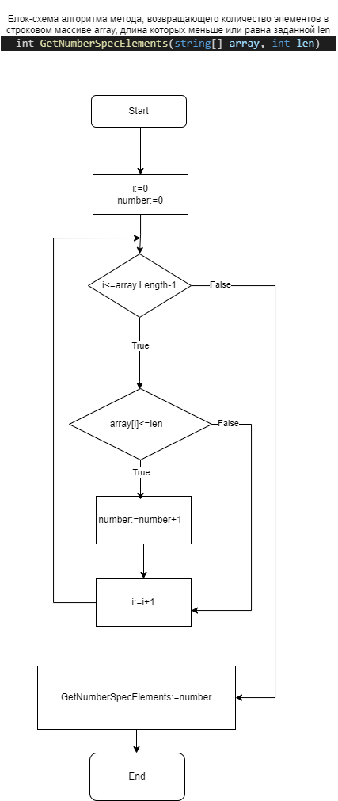

### Программа выводит массив из элементов заданного текстового массива *text* длина которых меньше или равна 3

**Описание алгоритма**

Для решения задачи используется 2 метода:

_**GetArraySpecElements(string[] array, int len)**_ - возврвщает массив из элементов исходного строкового массива array, длина которых меньше или равна заданной - len

_**GetNumberSpecElements(string[] array, int len)**_ - вспомогательный метод, возвращающий количество элементов исходного строкового массива, длина которызх меньше заданной. Нужен для определения количества элементов в результирующем массиве.

